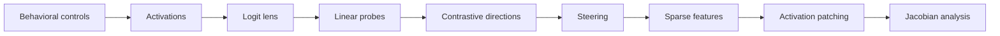

# Latent TRIZ

**Do language models rediscover general operators of invention?**

Latent TRIZ is an open laboratory for testing whether language models learn internal, cross-domain, and causally active transformations that resemble TRIZ Inventive Principles. The project combines reproducible experiments, mechanistic interpretability, blinded evaluation, and explicit falsification criteria.

> **Current evidence boundary:** the repository contains a functioning, deterministic Stage 1 protocol smoke test and research-governance infrastructure. It does **not** yet contain evidence that a TRIZ-like representation exists in any model. Every scientific claim starts at E0: hypothesis.

## Run the laboratory

```bash
git clone https://github.com/MarcoPorcellato/Latent-TRIZ.git
cd Latent-TRIZ
make lab
```

This opens the synthetic Lab 00 report locally. Its data are marked `non_empirical`; passing it demonstrates process integrity, not the hypothesis. The cross-platform canonical command, which does not require Make, is:

```bash
PYTHONPATH=src python3 -m latent_triz.cli lab00 --output artifacts/lab00/index.html --open
```

Developer validation and target-specific readiness reports are separate:

```bash
make check
make readiness TARGET=foundation
make lab01-bootstrap
make readiness TARGET=lab01
make readiness TARGET=lab02
make readiness TARGET=exp001
```

Readiness is fail-closed and target-specific. `foundation` validates repository integrity, `lab01` verifies the local exact-revision model and instrumentation bundle, `lab02` renders dataset-release readiness, and `exp001` evaluates the model-candidate and dataset gates. A selected model is only **model-contract-ready** or **model-preflight-ready** until acquisition, integrity, load, and instrumentation receipts prove otherwise.

## Lab 00

Lab 00 is the one-command public visual surface for the synthetic Stage 1 smoke bundle. It is infrastructure-only, is not attached to any scientific claim, and does not add empirical evidence.

Run the headless variant with no model, API key, service, or package installation:

```bash
make lab-render
```

`make lab` first reproduces and validates the frozen smoke artifacts, renders the report, and asks the operating system to open it. For headless environments, `make lab-render` writes `artifacts/lab00/index.html` without opening a browser. The underlying command is:

```bash
PYTHONPATH=src python3 -m latent_triz.cli lab00 --output artifacts/lab00/index.html --open
```

The Lab 00 view reuses only tracked synthetic artifacts in `data/pilot/`, displays the cases, blind allocation, response pairing, six score dimensions, summary deltas, and provenance hashes, and keeps the non-empirical boundary visible in the UI.

## The hypothesis

The **Weak Latent TRIZ Hypothesis** predicts that pretrained language models contain representations corresponding to at least some TRIZ Inventive Principles and that those representations generalize across substantially different domains.

The **Strong Latent TRIZ Hypothesis** predicts that a neural sequence model can develop functionally equivalent representations from unlabelled problem-solution examples without receiving TRIZ terminology, definitions, principle labels, or canonical examples.

- **Track A — pretrained models:** inspect openly available base and instruction-tuned checkpoints for cross-domain, causally active TRIZ-like representations.
- **Track B — controlled emergence:** train small Transformers on fully inspectable corpora that exclude explicit TRIZ material.

A probe score, attractive cluster, or behavioral anecdote is insufficient. Strong evidence must converge across lexical controls, cross-domain transfer, causal intervention, bidirectionality, novel cases, composition, model families, and controlled emergence.

## Evidence Ladder

| Level | Meaning | Minimum interpretation |
|---|---|---|
| E0 | Hypothesis | Registered, falsifiable, no empirical support claimed |
| E1 | Behavioral observation | Effect observed under documented behavioral controls |
| E2 | Cross-domain decodability | Representation decodes beyond lexical and domain shortcuts |
| E3 | Causal steering | Intervention changes behavior in the predicted direction |
| E4 | Bidirectional causality | Opposing interventions produce opposing, controlled effects |
| E5 | Cross-model replication | Result reproduces across independent model families or teams |
| E6 | Controlled emergence | Equivalent operators emerge in a controlled training setting |

Promotion is evidence-bound: a claim may advance only when its preregistration, immutable dataset snapshot, run records, results, and replication links satisfy the level's proof obligations. See the [Evidence Ladder](docs/EVIDENCE_LADDER.md) and machine-readable [claim registry](data/claims.jsonl). The initial claims are all E0 and untested.

## From visible behavior to mechanism

The planned experimental route deliberately grows in complexity:



Each step must earn the next. The near-term target is a local, visual, one-command exploration lab; the current Stage 1 smoke establishes the artifact and evaluation path that this empirical work will use.

## Public artifact chain

```text
hypothesis -> preregistration -> dataset snapshot -> study manifest
           -> immutable run records -> blinded evaluation -> versioned results
```

Exploratory work may happen earlier, but it remains visibly separate from confirmatory records. Results are versioned rather than overwritten, and model, prompt, seed, environment, schema, and output hashes travel with every run.

## Start here

- [Documentation portal](docs/index.md) — maintained documentation map
- [Evidence Ladder](docs/EVIDENCE_LADDER.md) — claim promotion rules E0–E6
- [Stage 1 blinded pilot](docs/STAGE1_PILOT.md) — runnable packet, response, annotation, and summary contracts
- [Lab 00 boundary](docs/STAGE1_PILOT.md#evidence-boundary) — presentation-only synthetic smoke view
- [Lab 01 model anatomy](docs/LAB01.md) — real-model instrumentation, G1-G8, and no-claim boundary
- [Lab 02 dataset anatomy](docs/LAB02.md) — snapshot integrity, leakage, balance, annotation reliability, and no-claim boundary
- [Research protocol](docs/RESEARCH_PROTOCOL.md) — controls, metrics, and decision criteria
- [Roadmap](docs/ROADMAP.md) — visual labs, EXP-001, and the replication program
- [EXP-001 readiness gates](docs/EXP001_READINESS.md) — offline model/dataset checks and remaining blockers
- [Article](docs/ARTICLE.md) and [article status](docs/ARTICLE_STATUS.md) — hypothesis framing and provenance
- [Claim registry](data/claims.jsonl) and [claim schema](schemas/claim.schema.json) — falsifiable public claims
- [Discussions](https://github.com/MarcoPorcellato/Latent-TRIZ/discussions) — research questions and collaboration

## Four contribution lanes

- **Lane 0 — Learning:** reproduce a tutorial or smoke path; no scientific claim is promoted.
- **Lane 1 — Exploratory:** add a clearly labeled probe, visualization, dataset audit, or candidate mechanism.
- **Lane 2 — Confirmatory:** execute a frozen preregistration against a sealed dataset and immutable run contract.
- **Lane 3 — Independent replication:** reproduce a result with an independent model family, dataset, implementation, or team.

TRIZ practitioners can help operationalize principles and design negative cases. Interpretability researchers can build probes and interventions. Python contributors can improve the lab and visual tooling. Statisticians can review power, multiplicity, and decision rules. Contributors with limited hardware can work on schemas, fixtures, annotation, documentation, or small-model experiments.

Read [CONTRIBUTING.md](CONTRIBUTING.md) before proposing a claim-level change.

## Repository status

- Foundation governance and schemas: implemented
- Matryca-Knowledge-style maintained documentation bundle: implemented
- Commit CI Preflight: configured with a dependency-free container runner to reduce unnecessary GitHub Actions usage
- Stage 1 deterministic blinded-pilot smoke: implemented, synthetic, non-empirical
- Lab 00 public visual surface: implemented, infrastructure-only, not claim-attached
- Lab 01 model anatomy: implemented on an exact-revision didactic model; empirical instrumentation only, not claim-eligible
- Lab 02 dataset anatomy: implemented as a synthetic, hash-backed dataset-readiness report; not claim-eligible
- Empirical support for the Latent TRIZ hypothesis: none claimed

## License and attribution

Copyright 2026 Marco Porcellato ([`MarcoPorcellato`](https://github.com/MarcoPorcellato)).

Licensed under the [Apache License 2.0](LICENSE). Attribution information is recorded in [NOTICE](NOTICE).
